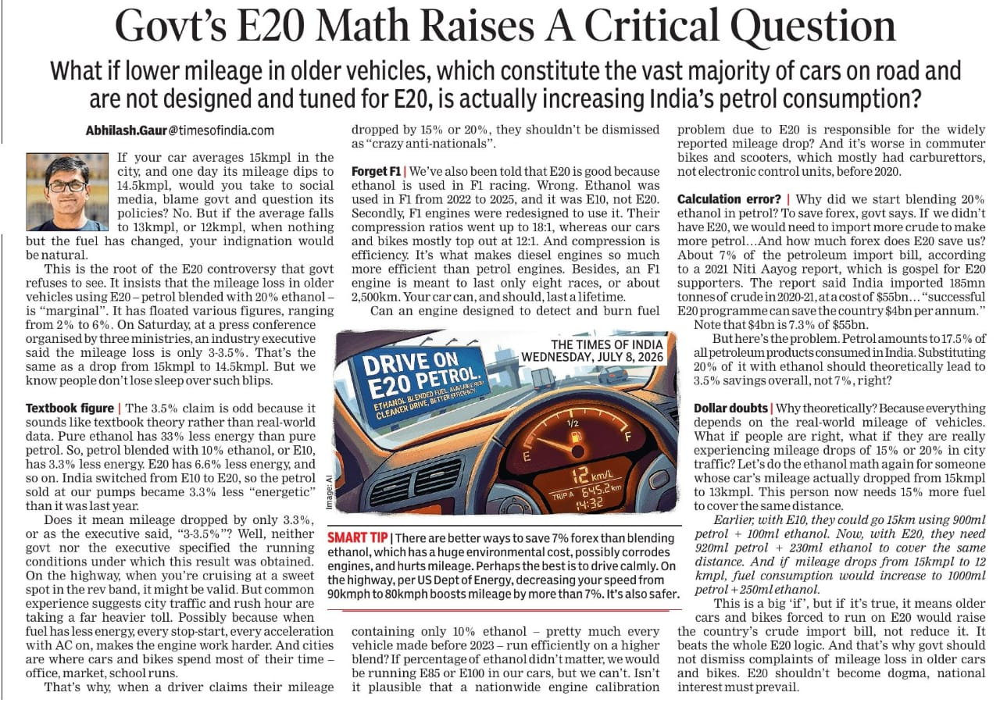
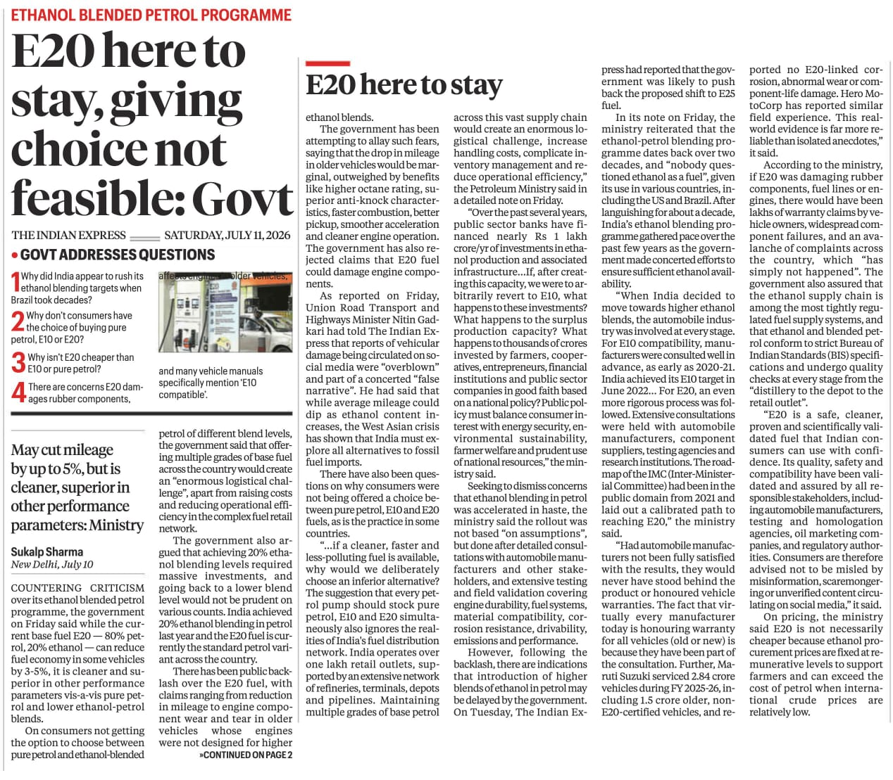

# An LCA Analysis of Ethanol Production from Maize: Economic and Environmental Implications

Date: 12-07-2026

National Average: India’s average maize yield is approximately 3.5 tonnes per hectare. Applying the standard conversion, this yields roughly 1,400 liters of ethanol per hectare

Approximate costs per hectare:

| Component                                                             |          ₹/ha | ₹/L ethanol (1,400 L/ha) |
| --------------------------------------------------------------------- | ------------: | -----------------------: |
| Seed                                                                  |   4,500–8,000 |                  3.2–5.7 |
| Fertilizer                                                            |   1,500–2,000 |                  1.1–1.4 |
| Irrigation energy                                                     |   3,000–7,000 |                  2.1–5.0 |
| Pesticides & chemicals                                                |   1,500–3,000 |                  1.1–2.1 |
| Labour                                                                | 10,000–25,000 |                 7.1–17.9 |
| Tractor hire & machinery                                              |  5,000–12,000 |                  3.6–8.6 |
| Harvesting equipment                                                  |   3,000–8,000 |                  2.1–5.7 |
| Drying & storage                                                      |   2,000–6,000 |                  1.4–4.3 |
| Storage losses (2–5%)                                                 |   1,500–4,000 |                  1.1–2.9 |
| Interest on working capital                                           |   2,000–5,000 |                  1.4–3.6 |
| Transport                                                             |   2,000–6,000 |                  1.4–4.3 |
| Ethanol processing (steam, electricity, enzymes, labor, depreciation) | 15,000–30,000 |                10.7–21.4 |

### Total excluding the value of maize grain

Per hectare:

₹51,500 - ₹116,000

Per liter:

\\[ \frac{51,500}{1,400} \approx ₹36.8/L \\]

\\[ \frac{116,000}{1,400} \approx ₹82.9/L \\]

A reasonable central estimate is therefore:

> **₹45–60 per liter** excluding the market value of the maize itself.

This is already substantial. If the maize grain itself is also valued economically (for example at MSP or market price), total costs can easily exceed **₹100/L**.

One more point: low Indian maize yields (~3.5 t/ha) significantly worsen economics. Countries like the United States often achieve **10–12 t/ha**, producing roughly **4,000–5,000 liters of ethanol per hectare**, which spreads fixed costs (labour, machinery, land, transport) over many more liters.

> India neither uses high-tech machinery nor precision farming to reduce input costs.

Thus, the relatively low yield in India is a major reason why maize-based ethanol can become expensive both economically and environmentally.

These are only approximate estimates. A comprehensive research-based life-cycle assessment (LCA) is needed to evaluate the environmental impacts, including [water consumption](https://www.indiatoday.in/information/story/ethanol-water-use-india-state-wise-biofuel-push-2925042-2026-06-11), fertilizer use, and pesticide use associated with ethanol production.

## The Food versus Fuel Dilemma: Risks to India's Food and Nutritional Security

[Biofuels: Area under maize cultivation in India increases sharply, driven by push for ethanol](https://www.downtoearth.org.in/energy/biofuels-area-under-maize-cultivation-in-india-increases-sharply-driven-by-push-for-ethanol)

India's push towards E20 ethanol blending has significantly increased the demand for maize, leading to an expansion of nearly 9 lakh hectares under maize cultivation during the 2025-26 kharif season. While higher maize prices have benefited many farmers in the short term, the rapid diversion of agricultural land towards fuel production raises serious concerns about India's long-term food and nutritional security.

The primary concern is the growing competition between fuel and food. Maize is not merely an industrial crop; it is a critical component of India's poultry and livestock sectors, which consume nearly 60-70 percent of the country's maize production. Diverting increasing quantities of maize towards ethanol production could tighten supplies for the feed industry, increasing the prices of eggs, milk, meat, and other essential food products. Thus, the impact of ethanol production extends far beyond maize itself and can contribute to broader food inflation.

Another worrying trend is the displacement of other important crops. Reports indicate that the expansion of maize cultivation is occurring partly at the expense of oilseeds, millets, and pulses. Areas under groundnut, soybean, sunflower, sorghum, pearl millet, and pigeon pea have declined. This shift is particularly concerning because these crops play a crucial role in India's nutritional security. Pulses are an essential source of protein for millions of Indians, while oilseeds are vital for reducing India's heavy dependence on edible oil imports. Replacing these crops with maize for ethanol could undermine national efforts towards nutritional self-sufficiency.

The ethanol-driven expansion of maize may also increase agricultural vulnerabilities. Maize cultivation in India generally relies on substantial inputs such as fertilizers, irrigation, seeds, labour, and transportation. Unlike countries with highly mechanized and precision-based farming systems, India still faces relatively high production costs and lower yields. Increasing dependence on input-intensive crops for fuel production may further strain water resources, fertilizer subsidies, and agricultural infrastructure.

More importantly, using food crops as fuel creates a strategic risk during years of poor monsoon or climate shocks. In years of drought, pest outbreaks, or global supply disruptions, governments may be forced to choose between ensuring food availability and maintaining fuel blending targets. Such trade-offs could become increasingly difficult as climate change makes agricultural production more volatile.

## Is Ethanol Production Really Worth It? What Exactly Are We Trying to Save?

This raises an important question: is large-scale ethanol production really worth it? What exactly are we trying to save—money, energy imports, or the environment? Based on the available evidence, the benefits appear far less certain than often claimed. If ethanol production relies heavily on food crops, intensive fertilizer use, irrigation, subsidies, and significant energy inputs for cultivation and processing, the economic and environmental gains may be substantially reduced. Without comprehensive life-cycle assessments and transparent cost-benefit analyses, it is difficult to conclude that ethanol provides meaningful savings either for the economy or for the environment. Rather than assuming ethanol is inherently sustainable, policymakers should carefully evaluate whether the resources devoted to it could be more effectively invested in other measures that improve energy security while protecting food and nutritional security.

## Lower Energy Density of Ethanol and Its Impact on Fuel Economy

*Ethanol has a significantly lower energy density than petrol**, containing approximately **33% less energy per litre**. 

### Impact on Fuel Economy

Because ethanol carries less energy per unit volume, vehicles require more fuel to produce the same amount of power, leading to reduced mileage:

*   **E10 Blend (10% Ethanol):** Typically results in a **3–4% drop** in fuel efficiency.
*   **E20 Blend (20% Ethanol):** Can cause a **4–8% drop** in fuel efficiency, depending on engine calibration.
*   **Pure Ethanol (E100):** May increase fuel consumption by over **40%** compared to pure petrol.

> Our vehicles aren't even ready for E20. Bringing ethanol is **like putting the cart before the horse**. If we are forced to replace them, why not go for electric instead of gasoline? Why force people to buy E20 vehicles?

## Ethanol Cannot Replace Fossil Fuels: The Case for Electrified Transport and Public Mobility

Ethanol is unlikely to become a complete replacement for fossil fuels, particularly in a country as large and populous as India. The amount of agricultural land, water, fertilizers, and other inputs required to produce sufficient ethanol for the transport sector would be enormous. Expanding ethanol production indefinitely could intensify competition for land and resources, potentially affecting food production, biodiversity, and environmental sustainability.

While ethanol may play a limited role as a transitional fuel or as a supplementary energy source, it should not be viewed as a long-term solution to India's energy and climate challenges. The energy density of ethanol is lower than petrol, and large-scale dependence on food-based feedstocks raises concerns regarding economic viability and resource efficiency.

A more sustainable pathway lies in the electrification of transportation. Electric two-wheelers, buses, and public transport systems can significantly reduce oil consumption while improving urban air quality. India already has one of the largest railway networks in the world, and further electrification of rail transport can substantially reduce dependence on imported fossil fuels. Similarly, modern electric tram systems and metro networks can provide efficient and affordable mobility for densely populated cities.

Rather than attempting to replace fossil fuels primarily through biofuels, India should prioritize reducing overall fuel demand through better urban planning, public transportation, and electrification. Investments in electric mobility, renewable electricity generation, and mass transit infrastructure are likely to deliver greater long-term economic and environmental benefits than large-scale reliance on food-based ethanol production.

