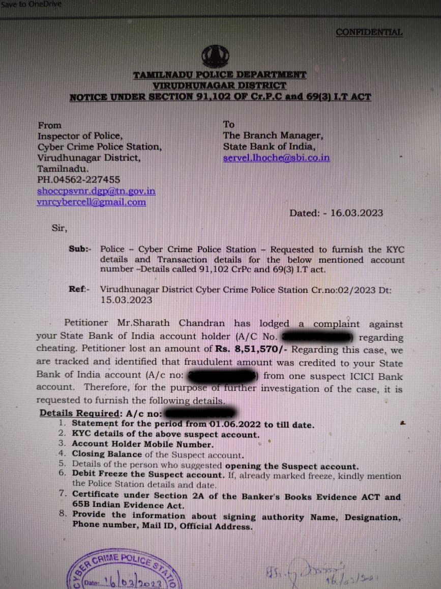

# Arbitrary Freezing of Account

The arbitrary freeze of bank accounts poses a significant threat to an individual's right to live and engage in economic activities. The sudden and unjustified blocking of a bank account can have severe consequences, including the destruction of livelihoods and the erosion of trust in the financial system. 

In such cases, the affected individual is often forced to navigate a complex and daunting process to clear their name and restore access to their account. The fact that an individual has provided all necessary transaction details to the bank manager and still has to resort to court action raises serious concerns about the accountability of financial institutions and the due process of law. 

Furthermore, the ease with which a fraudulent person can file a fake case with the police and trigger an account freeze has created a culture of impunity, where the police and financial institutions often fail to verify the authenticity of the case before taking action. This raises fundamental questions about the rule of law and the protection of individual rights in the face of arbitrary and unjust state action.

## My account blocking

My account has been blocked by SBI for one year. If I have provided all the transaction details to the bank manager, why do I have to go to court?

So, any fraudulent person can file a fake case with the police, and there's no responsibility on the police to check the authenticity of the case before blocking my account?

There are no transfer of 8,51,570 to my account from any account. It was just wire transfer for hackathon prize, which I can give the transaction details.
