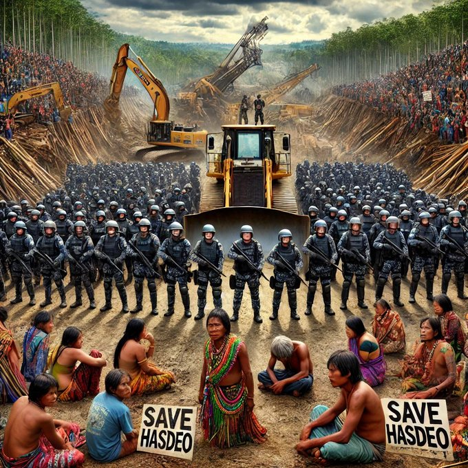

# Police Loyalty to the People and the Constitution, Not to Political Powers or Corporations

In a democracy like India, the police force is expected to serve and protect the people, uphold the Constitution, and act as guardians of justice. Unfortunately, recent events in Chhattisgarh’s Hasdeo forest, where police clashed with villagers over the felling of trees for a coal mining project, have highlighted a growing concern: the police, in many instances, seem more loyal to political powers and corporate interests than to the very people and Constitution they are sworn to protect.

### The Hasdeo Forest Tragedy: A Tale of Betrayal

The conflict in Hasdeo forest centers around the Parsa coal block mining project awarded to Rajasthan Rajya Vidyut Utpadan Nigam Limited (RRVUNL), where the authorities intend to fell approximately 5,000 trees. This is not just an environmental issue; it’s a matter of survival for the local indigenous communities, whose lives and livelihoods depend on the forest. The people of six villages near Fatehpur and Sali have shown clear opposition to the destruction of their environment, gathering in protest to prevent the felling of trees. 

However, instead of facilitating dialogue or respecting the people’s will, the state responded by deploying 400 police and Forest Department personnel. The ensuing clash, with villagers reportedly armed with wooden sticks, arrows, and axes, starkly contrasts with the heavily equipped police force acting under orders. It was a tragic and unnecessary escalation, with arrows flying and violence erupting—a stark reminder of the increasing dissonance between the police’s duty to the people and their actions in service of political and corporate interests.

### The Role of the Police: Servants of the Constitution, Not Corporate Entities

The Constitution of India enshrines the sovereignty of the people and the importance of the environment. The Preamble speaks of justice, equality, and fraternity, while Article 21 guarantees the right to life, which includes the right to a healthy environment. When police officers act in defense of corporate interests, especially at the expense of indigenous people’s rights and environmental sustainability, they betray these foundational principles.

The police are meant to enforce laws that safeguard the public good, not to become tools of oppression used by the state or big businesses. By facilitating the felling of trees that local communities oppose, the police in this case have acted in direct conflict with the will of the people they are supposed to serve. Their actions suggest loyalty to a corporate entity and the political powers in charge rather than to their fellow citizens or the Constitution.

### Disobedience: A Rightful Response to Oppression

When the state, through its police force, acts against the people’s interests, civil disobedience becomes not just a right but a moral duty. The Hasdeo villagers, defending their forest and future generations, are exercising their legitimate right to resist. Nonviolent resistance has been a cornerstone of India's own struggle for freedom, led by Mahatma Gandhi, who demonstrated that civil disobedience is a powerful tool against unjust laws and state violence.

The pluralistic model of society demands that diverse voices be heard—especially those of marginalized communities. In a healthy democracy, the interests of indigenous peoples, environmental conservation, and corporate profits must be balanced. However, in Hasdeo, the balance is clearly skewed. The forceful intervention by the police signals the prioritization of corporate and political interests over ecological and human rights.

### Police as Traitors to the Taxpayer?

The Indian police are funded by the taxes of ordinary citizens, the same citizens they are meant to protect. Yet, when they act as agents of the powerful, enforcing actions that the public opposes, they betray the trust placed in them. In Hasdeo, the police’s willingness to resort to violence against villagers who pay taxes and contribute to their salaries is an act of deep betrayal. How can the public trust a force that seems to be at odds with their wellbeing and willing to harm them for the sake of corporate greed?

[Rahul Gandhi, condemning the violent use of police force in Hasdeo, highlighted a critical issue that goes beyond the immediate incident.](https://indianexpress.com/article/india/arrows-fly-as-villagers-clash-with-cops-over-tree-felling-in-chhattisgarhs-hasdeo-forest-rahul-gandhi-condemns-violent-use-of-police-force-9625947/) It’s about the role of the police in a democracy: **Are they protectors of the people or enforcers of corporate and political will?** If the answer veers toward the latter, then disobedience becomes not just justified but essential to reclaim democracy itself.

### The Way Forward: A Police Force for the People

The Hasdeo incident underscores the urgent need to reform the relationship between the police, the people, and the Constitution. Police officers must remember their primary duty is to the citizens of India and to the legal and moral framework that governs the country. The loyalty of the police should lie with the people and their constitutional rights, not with those in power or wealthy corporations.

As the situation in Hasdeo shows, the consequences of misplaced police loyalty are devastating. When the state chooses corporate interests over the environment and the rights of its people, it fails to fulfill its most basic responsibilities. And when the police, the enforcers of law and order, side with the powerful instead of the people, it undermines the very fabric of democracy.

In conclusion, the police must reorient their loyalty toward the people and the Constitution. Disobedience to illegitimate authority is a rightful course of action, as is protecting the environment and the livelihoods of local communities. The battle for Hasdeo forest is a battle for the soul of Indian democracy. The question is: Will the police be on the side of the people, or will they continue to serve as instruments of oppression? The answer will shape the future of both our democracy and our environment.
