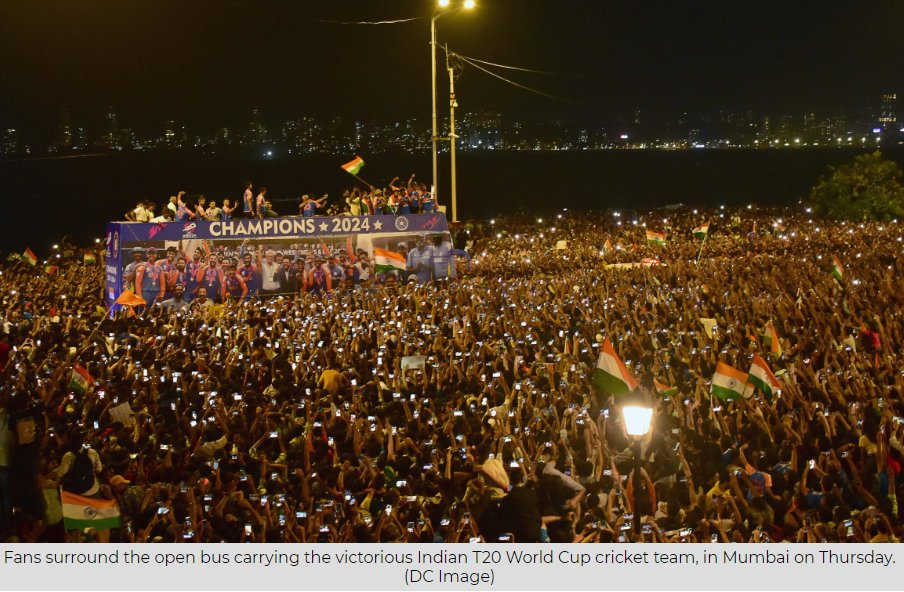
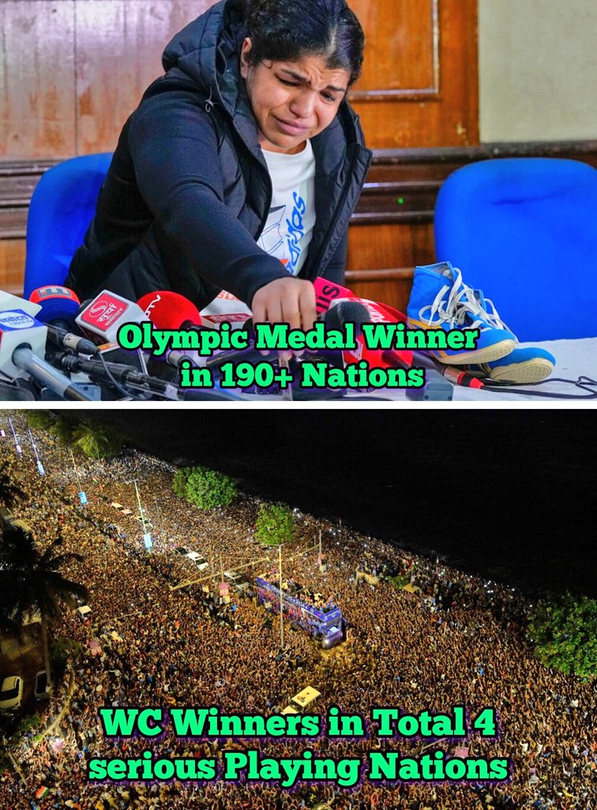

# Bread and Circuses: The Distracted Youth of India

[Bread and Circus in the Digital Age: A Modern-Day Distraction from Reality](https://iambrainstorming.github.io/chapters/philosophy/bread_and_circus.html)

The recent victory parade for India's T20 World Cup win saw over 300,000 Indian youth in attendance, celebrating the triumph of their cricket team. However, this enthusiasm and unity are often lacking when it comes to addressing the country's pressing issues. The term "bread and circuses" comes to mind, as the Indian youth seem more interested in entertainment and distractions than engaging with the problems that affect their future.

## Draconian Amendments to Criminal Laws

One concerning development is the lack of protest against the recent amendments to India's criminal laws. These changes have the potential to turn India into a police state, with far-reaching implications for its citizens.

### Extended Police Custody

The new criminal law allows the police to seek direct custody of an accused for up to 60 days, a significant increase from the previous limit of 15 days. This change makes it even more difficult for accused individuals to obtain bail, as courts are typically reluctant to grant bail during police custody. With India's overcrowded jails already housing 75% under-trials, the "bail, not jail" principle emphasized by the Supreme Court is under threat.

### Sedition and Free Speech

While the word "sedition" has been absent from the new criminal law, experts argue that a more draconian version has been introduced through the back door. The criminalization of vague actions, such as "endangering sovereignty or unity and integrity of India," carries harsh punishments of up to life imprisonment. This raises concerns about free speech and the potential misuse of power by authorities.

### Three important cases pending on supreme court

#### Contitutional Validity of PMLA
Firstly, the constitutional validity of the PMLA is being challenged in the Supreme Court. The law has been criticized for being excessively harsh and disproportionate in its application, with many opposition politicians being targeted under it. The Supreme Court must examine the law's provisions and decide if they are constitutional or not. This case is of utmost importance, as the misuse of the PMLA and the Enforcement Directorate (ED) has been a contentious issue in Indian politics.

#### What is a Money Bill?
Secondly, the status of the Money Bill is pending before the Supreme Court. The government has been accused of using the Money Bill route to pass unconstitutional laws without the scrutiny of the Rajya Sabha. The apex court must clarify the definition of a Money Bill and ensure that it is not misused by the government. This case is crucial for the balance of power between the executive and legislative branches of the government.

#### Ritu Chhabria Case

In the Ritu Chhabria case, as per the law, an accused person is entitled to default bail if the charge sheet filed by the state is incomplete and requires further investigation under the Code of Criminal Procedure (CrPC). The time period for an investigative agency to complete an investigation and file a charge sheet ranges from 60 to 90 days, depending on the type of crime. If the agency fails to complete the investigation within the stipulated time, the accused is entitled to default bail or automatic bail.

However, this is not happening. In order to defeat the right to default bail, investigative agencies these days file charge sheets despite not completing the investigation. This is done solely to keep the accused incarcerated for a longer period. As a result, the accused remains incarcerated for a long time, which is a clear violation of their rights and the principles of justice and fairness.

<iframe width="560" height="315" src="https://www.youtube.com/embed/HbzQ9V31Zj8?si=pvwQreC9ltKh9XEB" title="YouTube video player" frameborder="0" allow="accelerometer; autoplay; clipboard-write; encrypted-media; gyroscope; picture-in-picture; web-share" referrerpolicy="strict-origin-when-cross-origin" allowfullscreen></iframe>

## NTA exam scam

The lack of public outrage and mass gatherings, similar to the victory parade celebrations, in response to the NTA scam is concerning. The government's decision to proceed with the counseling process, despite the ongoing controversy, further highlights the disconnect between the authorities and the students' plight. 

[Millions of students at risk: India’s elite exams hit by corruption ‘scam’](https://www.aljazeera.com/news/2024/6/21/millions-of-students-at-risk-indias-elite-exams-hit-by-corruption-scam)

## Apathy Towards Protesting Athletes

The Indian youth's enthusiasm for cricket and its players is undeniable, but where is this support when other athletes stand up for important causes? In May 2023, Olympic medal winner Vinesh Phogat and fellow wrestlers protested against the IOA's top official, Brij Bhushan Sharan Singh, who was accused of sexual harassment and abuse.  Despite the presence of celebrated Olympic medallists, the protest was largely ignored by the cricket fraternity, with hardly any cricketers voicing their support. The absence of mass gatherings and a public outcry, similar to the victory parade for T20 Cup that attracted hundreds of thousands, highlights a selective interest in issues that demand attention and action. 

## Silence on EVM Manipulation

The manipulation of Electronic Voting Machines (EVMs) in India has become increasingly apparent, with widespread mismatches between EVM votes during polling and counting. This raises serious concerns about the integrity of the voting process and democracy itself. However, there has been little to no outcry or gathering of the youth to demand transparency and accountability.

## Ignoring the Manipur Crisis

The ongoing violence in Manipur has resulted in 175 deaths and over 1,100 injuries in just four months, according to police reports. Disturbing incidents, such as the assault and stripping of two women by a mob, have been brought to light. Yet, there is a notable absence of youth gatherings or protests demanding justice and an end to the violence.

## The Spectator Sport Conundrum

Cricket's dominance as a spectator sport in India raises questions about the lack of participation in other sports.  The lack of sufficient playgrounds and funding for sports infrastructure means that the majority of Indians are relegated to the role of spectators rather than active participants. Should cricket be considered a true sport in India when the majority of people only watch and do not actively participate?

## Conclusion

The Indian youth's obsession with cricket and lack of engagement in societal issues is concerning. While distractions like sports and entertainment are important, they should not come at the cost of apathy towards pressing matters. It is crucial for the youth to recognize their power and use it to address the challenges facing their country. True progress and change require an informed and active citizenry that goes beyond the "bread and circuses" mentality.
