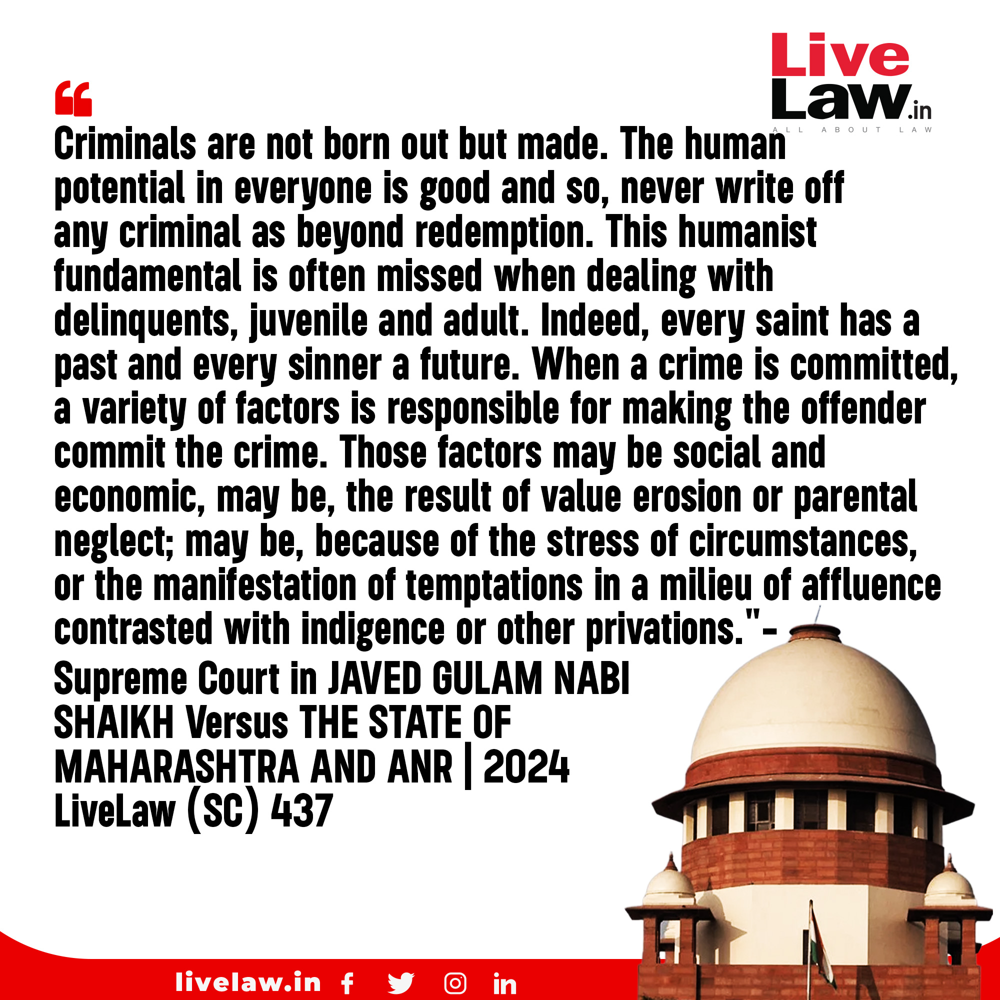
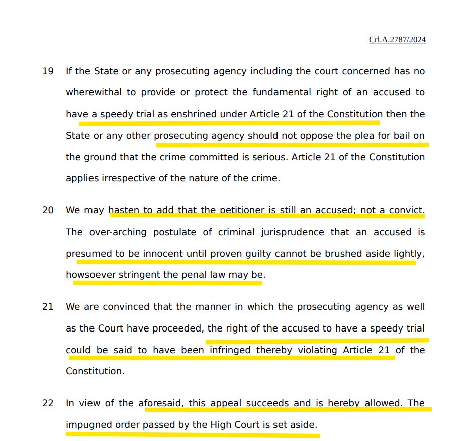

# Criminals are not born out but made

[Nurture vs. Nature: The Complex Interaction of Genes and Environment](./nurture_vs_nature.md)

Criminals are not born but made. The court has made an important judgment affirming that a speedy trial is a fundamental right.

If the prosecuting agency can't ensure a speedy trial, they shouldn't oppose bail citing the seriousness of the offense: Supreme Court.

"Innocent until proven guilty" cannot be ruled out, no matter how stringent the penal law may be.

> But will this be applicable to all citizens? Does the court follow the rule of law? With crores of cases pending, many don't even get a hearing. It is difficult to get a hearing, with dates getting delayed repeatedly.

For example, in seven years, [10,552 Indians have been arrested under UAPA](https://scroll.in/article/1010530/in-seven-years-10552-indians-have-been-arrested-under-uapa-and-253-convicted)– but only 253 have been convicted.

### Three important cases pending on supreme court

#### Contitutional Validity of PMLA
Firstly, the constitutional validity of the PMLA is being challenged in the Supreme Court. The law has been criticized for being excessively harsh and disproportionate in its application, with many opposition politicians being targeted under it. The Supreme Court must examine the law's provisions and decide if they are constitutional or not. This case is of utmost importance, as the misuse of the PMLA and the Enforcement Directorate (ED) has been a contentious issue in Indian politics.

#### What is a Money Bill?
Secondly, the status of the Money Bill is pending before the Supreme Court. The government has been accused of using the Money Bill route to pass unconstitutional laws without the scrutiny of the Rajya Sabha. The apex court must clarify the definition of a Money Bill and ensure that it is not misused by the government. This case is crucial for the balance of power between the executive and legislative branches of the government.

#### Ritu Chhabria Case

In the Ritu Chhabria case, as per the law, an accused person is entitled to default bail if the charge sheet filed by the state is incomplete and requires further investigation under the Code of Criminal Procedure (CrPC). The time period for an investigative agency to complete an investigation and file a charge sheet ranges from 60 to 90 days, depending on the type of crime. If the agency fails to complete the investigation within the stipulated time, the accused is entitled to default bail or automatic bail.

However, this is not happening. In order to defeat the right to default bail, investigative agencies these days file charge sheets despite not completing the investigation. This is done solely to keep the accused incarcerated for a longer period. As a result, the accused remains incarcerated for a long time, which is a clear violation of their rights and the principles of justice and fairness.

<iframe width="560" height="315" src="https://www.youtube.com/embed/HbzQ9V31Zj8?si=pvwQreC9ltKh9XEB" title="YouTube video player" frameborder="0" allow="accelerometer; autoplay; clipboard-write; encrypted-media; gyroscope; picture-in-picture; web-share" referrerpolicy="strict-origin-when-cross-origin" allowfullscreen></iframe>

