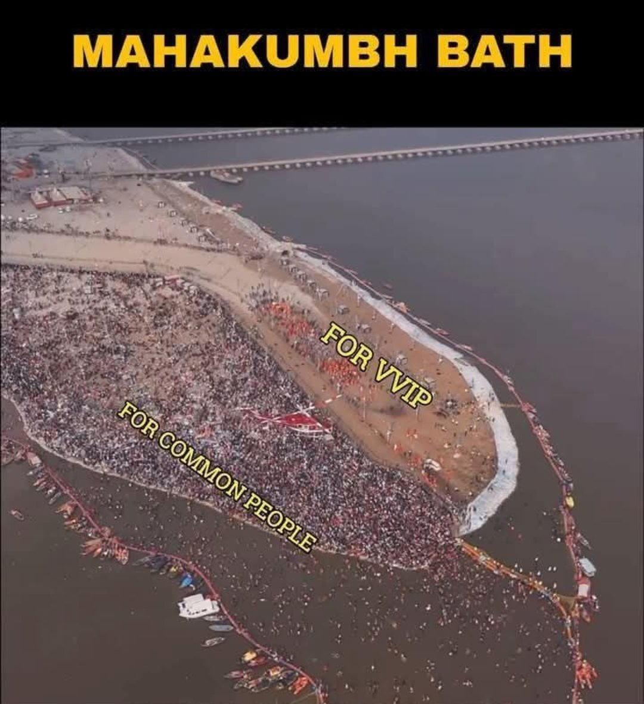

# Mahakumbh Mela: A Product of Rampant Superstition Plaguing India  

Mahakumbh Mela, one of the largest religious gatherings in the world, attracts millions of devotees who take a dip in the sacred rivers, believing it will cleanse them of their sins and relieve their suffering. However, beneath the veneer of spirituality lies a complex web of superstition, public health risks, and socio-political manipulation that raises serious concerns.  

---

### Public Health Hazard: Fecal Contamination in Holy Waters  

Despite its spiritual significance, the water quality in the rivers during Mahakumbh is alarming. [Studies have shown dangerously high levels of fecal contamination, making the water unfit for bathing or drinking](https://www.barandbench.com/news/fecal-levels-maha-kumbh-river-water-concerning-not-fit-bathing-pollution-board-ngt). Yet, millions of devotees take ritualistic dips and even consume this polluted water, putting themselves at risk of severe health issues, including gastrointestinal diseases and skin infections.  

This blind faith, driven by superstition rather than rationality, raises critical questions about public awareness and health safety. It is concerning that devotees continue to endanger themselves, believing that a ritual bath can wash away their sins and suffering.  

---

### Deep-Rooted VIP Culture and Social Inequality  

Mahakumbh Mela starkly reflects India's entrenched VIP culture. Approximately one-third of the area is reserved for VIPs, while the remaining space is crammed with millions of ordinary citizens, struggling for access and basic amenities.  

This blatant division highlights the social inequality plaguing Indian society. The privileged few enjoy comfort and security, while the masses are left to fend for themselves in congested and often unhygienic conditions. Such stark disparity contradicts the egalitarian spiritual principles that the event supposedly embodies.

---

### Superstition Over Rational Solutions  

The belief that bathing in Mahakumbh can absolve one’s past karma and alleviate suffering is not just a matter of faith but a troubling example of superstition overshadowing rational problem-solving. People attribute their hardships to past misdeeds rather than addressing the systemic issues causing their suffering.  

This misplaced faith diverts attention from necessary reforms, including the need to tackle political corruption, economic inequality, and institutional failures. Instead of demanding accountability from leaders or seeking practical solutions to social issues, people rely on ritualistic cleansing as a cure-all.  

---

### Political Manipulation and Vote Bank Strategy  

Mahakumbh Mela is not just a religious event; it is a potent political tool. Politicians exploit the occasion to appeal to religious sentiments, securing vote banks through emotional manipulation and superstition. By championing religious narratives, they cleverly distract people from critical issues like unemployment, corruption, and economic hardship.  

This strategic use of superstition allows leaders to escape accountability, keeping the public distracted and disempowered. Instead of fostering a politically conscious citizenry, this exploitation reinforces ignorance and blind faith.  

---

### Poor Crowd Management and Loss of Lives  

The sheer scale of Mahakumbh Mela requires meticulous planning and crowd control. Yet, year after year, it reveals a grim reality of administrative failure. In one tragic incident, [dozens of people were killed in a pre-dawn stampede](https://www.reuters.com/world/india/casualties-feared-stampede-breaks-out-indias-maha-kumbh-festival-hindu-reports-2025-01-29/). The local hospital's morgue received 39 bodies within 12 hours, with more arriving throughout the day.  

This heartbreaking event exposes the government's inability to manage such massive crowds safely. Despite knowing the expected turnout, authorities failed to implement effective safety measures, leading to unnecessary loss of lives. It highlights the urgent need for better crowd management strategies, advanced surveillance, and improved emergency response systems.  

---

### A Call for Reform and Rational Thinking  

India's progress depends on breaking free from the shackles of superstition and embracing rational, evidence-based thinking. Mahakumbh Mela, in its current form, highlights the urgent need for social and political reform.  

- Public health awareness must be prioritized, emphasizing the dangers of contaminated water.  
- Social equality should be reflected in event management, abolishing preferential treatment for VIPs.  
- Political narratives should shift from superstition-driven vote-bank politics to genuine developmental agendas.  
- Most importantly, improved crowd management and safety protocols are essential to prevent tragic stampedes and loss of lives.  

It is high time that India re-examines the role of rituals and beliefs in public life. Spirituality and faith are personal choices, but they should not come at the cost of public health, social equality, or rational governance.

