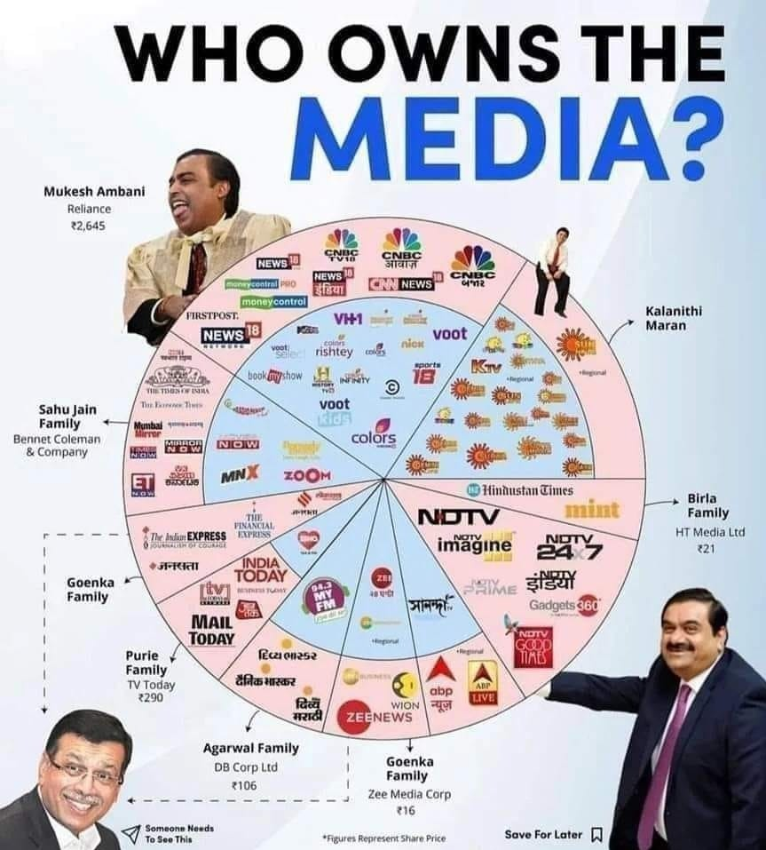

# Print Media vs Mainstream TV Media: Which one provides more authentic news that matters to the people?

## Print Media: Funding and Authenticity

Print media in India, such as newspapers and magazines, rely primarily on reader subscriptions for funding. This means that the news provided by print media is mostly funded by users rather than corporations or advertisers. As a result, print media tends to focus on delivering authentic news that matters to the people, as they are directly accountable to their readers.

In recent years, print media has played a significant role in reporting news that mainstream TV media has largely ignored. For example, print media provided detailed news coverage of the electoral bonds scam, which involved the alleged misuse of funds by political parties. Similarly, print media reported extensively on the "BJP washing machine" scandal, highlighting how 25 opposition leaders facing corruption charges crossed over to the BJP, with 23 of them getting a reprieve.

## Mainstream TV Media: Funding and Influence

Mainstream TV media in India, on the other hand, is funded mostly by advertisers and corporations. This has raised concerns about the influence of these entities on the news reporting process. Many argue that mainstream TV media tends to prioritize sensationalism and entertainment over providing in-depth, authentic news coverage.

Moreover, mainstream TV media comes with minimal TV package options, and users cannot unsubscribe news channels to save a substantial amount of money. This has led to a situation where people are forced to consume news from TV channels that may not provide authentic and unbiased information.

## How can we tackle mainstream media? 

The [Supreme Court stated](https://www.indiatoday.in/law-today/story/supreme-court-on-pleas-regulate-tv-news-channels-media-tribunal-2418224-2023-08-08), "Don't watch if you don't like: Supreme Court on pleas to regulate TV news channels." However, the government is forcing us to pay for these channels through the minimum TV package. To address this issue, TV news channels should be excluded from the minimum package, allowing users to choose which channels they pay for. Why should we pay for propaganda channels? A similar Public Interest Litigation (PIL) should be submitted before the court to advocate for this change.

## Conclusion

While a statistical analysis of news coverage in both print and TV media would provide more concrete evidence, the anecdotal evidence presented in this article suggests that print media may indeed be a better source for authentic news in India. As citizens, it is essential to support and encourage the growth of independent, authentic news sources to ensure a well-informed and engaged society.

<iframe width="560" height="315" src="https://www.youtube.com/embed/nyjuZjF7r6g?si=zSclToWyOVIIFVK7" title="YouTube video player" frameborder="0" allow="accelerometer; autoplay; clipboard-write; encrypted-media; gyroscope; picture-in-picture; web-share" referrerpolicy="strict-origin-when-cross-origin" allowfullscreen></iframe>

