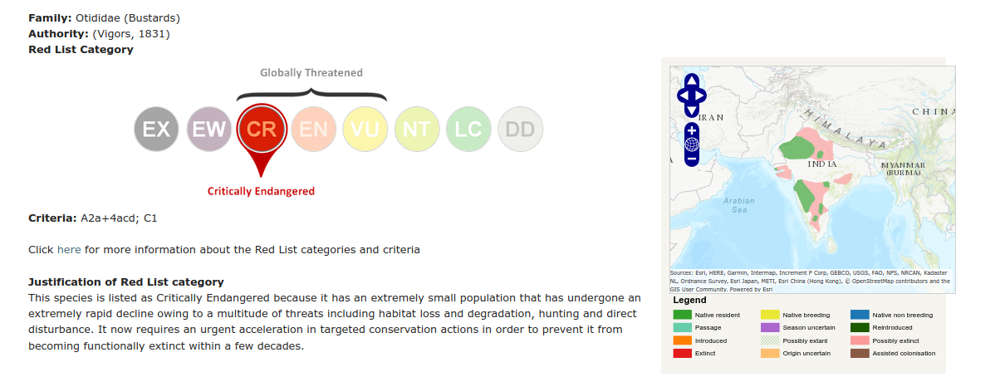

# Is protecting climate recognized as a fundamental right, or is it merely serving corporate profit?

[Great Indian Bustard Ardeotis nigriceps is a critically endangered species](http://datazone.birdlife.org/species/factsheet/22691932)

People have fundamental right to be free from impact of climate change: Supreme Court
[The top court made these remarks while lifting the blanket ban it had put on the laying of over-the-ground power lines in areas frequented by the bird commonly known as the Great Indian Bustard (GIB).](https://www.barandbench.com/news/people-fundamental-right-free-impact-climate-change-supreme-court) 

### The Supreme Court says that people have the right to be free from the adverse effects of climate change. Is this truly the case, or is the judgment primarily aimed at saving corporate costs?

> What is the extent of the Great Indian Bustard's habitat? What is the cost of installing underground wires? Additionally, what are the advantages and disadvantages of underground wires, and what are the long-term costs associated with them?

These are questions that need to be addressed.

### Undergrounding 

In civil engineering, undergrounding is the replacement of overhead cables providing electrical power or telecommunications, with underground cables. It helps in wildfire prevention and in making the power lines less susceptible to outages during high winds, thunderstorms or heavy snow or ice storms. An added benefit of undergrounding is the aesthetic quality of the landscape without the powerlines. Undergrounding can increase the capital cost of electric power transmission and distribution but may decrease operating costs over the lifetime of the cables. 

Underground cables pose no hazard to low-flying aircraft or to wildlife.

Above-ground lines cost around $10 per 1-foot (0.30 m) and underground lines cost in the range of $20 to $40 per 1-foot (0.30 m). In highly urbanized areas, the cost of underground transmission can be 10–14 times as expensive as overhead. However, these calculations may neglect the cost of power interruptions. 

The lifetime cost difference is smaller for lower-voltage distribution networks, on the range of 12-28% higher than overhead lines of equivalent voltage.

[Advantages and disadvantages of Undergrounding](https://en.wikipedia.org/wiki/Undergrounding)

### How do the birds die?

[The birds weigh 14-15 kilograms each and can reach a height of up to 4 feet, making them too heavy to change their course mid-way when they wander too close to power lines. They get electrocuted and die, Jagani added.](https://www.downtoearth.org.in/news/wildlife-biodiversity/supreme-court-seeks-update-on-power-cables-at-great-indian-bustard-s-habitat-82233)

### Aerial insulated cables

[There are also above ground insulated cables that can protect birds from electroculation](https://en.wikipedia.org/wiki/Aerial_cable)

[Development and installation of a 69 kV aerial cable system](https://ieeexplore.ieee.org/document/756159)

