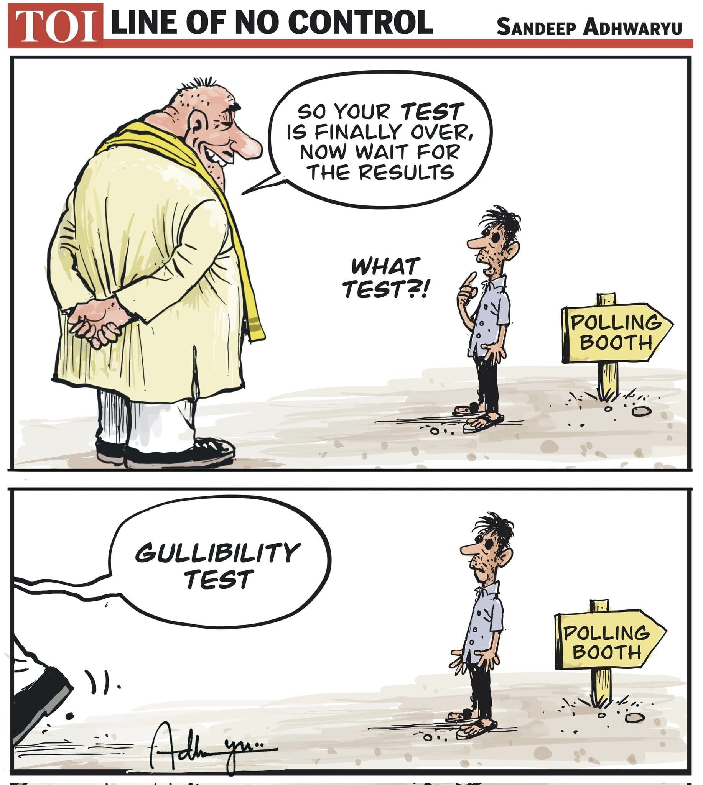

# Gullibility Test

__gullibility__

tendency to believe too readily and therefore to be easily deceived
 
Gullibility is a failure of social intelligence in which a person is easily tricked or manipulated into an ill-advised course of action. It is closely related to credulity, which is the tendency to believe unlikely propositions that are unsupported by evidence.

1) If the next time, people elect Modi, he will leave no stone unturned to destroy the economy. The impact of many times national debt created, rampant taxation, taking over all institutions and corrupting it, and disinformation will soon be seen in the next five years.

In a democracy, the people's choice holds immense power. If the Indian electorate chooses to re-elect Prime Minister Narendra Modi, it is crucial to understand the potential economic implications of his leadership. With a track record of excessive borrowing, increased taxation, and the erosion of institutional integrity, the next five years could witness a severe economic downturn.

2) Debt can boost the economy for some time, everything can appear green for that time, but finally, you have to pay the debt.

While short-term economic growth can be stimulated by borrowing, the long-term consequences of accumulating debt can be devastating. As the debt burden grows, the government's ability to invest in essential sectors like infrastructure, education, and healthcare diminishes. Eventually, the repayment of these debts will necessitate austerity measures, leading to reduced public spending and further economic contraction.

3) As govt will have no money left for spending, it will rely on taxes as much as they can, taxing everything possible. Excessive taxation will cause dead weight loss, which means a decrease in trade, rise of prices, creating a vicious cycle for economic collapse.

Faced with mounting debt and dwindling resources, the government may resort to excessive taxation to generate revenue. However, this strategy can backfire, leading to a decrease in trade, higher prices, and ultimately, an economic collapse. Dead weight loss, a term used in economics to describe the loss of economic efficiency, can result from such policies, as consumers and businesses adjust their behavior to avoid the increased tax burden.

4) Govt can also rely on printing more and more money for govt spending ultimately devaluing the currency.

Another potential response to the government's financial woes is the printing of more money to fund public spending. While this may provide temporary relief, it can lead to inflation and the devaluation of the currency. As the value of the rupee decreases, imports become more expensive, and the purchasing power of the average citizen diminishes. This can further exacerbate the economic crisis.

5) We already seen economic policies like demonetization and COVID mismanagement which made a disastrous impact on the economy.

The economic policies implemented under Prime Minister Modi's leadership, such as demonetization and the mishandling of the COVID-19 pandemic, have already had a detrimental impact on the Indian economy. 

