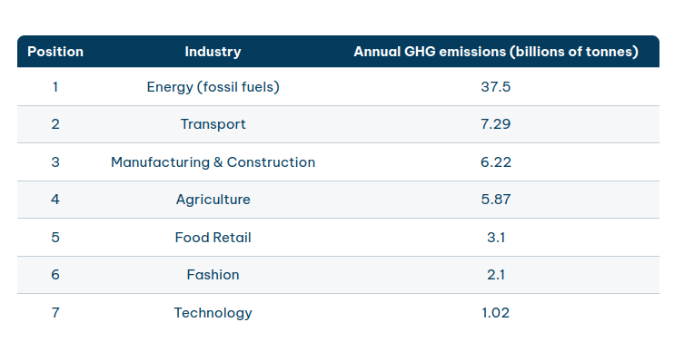
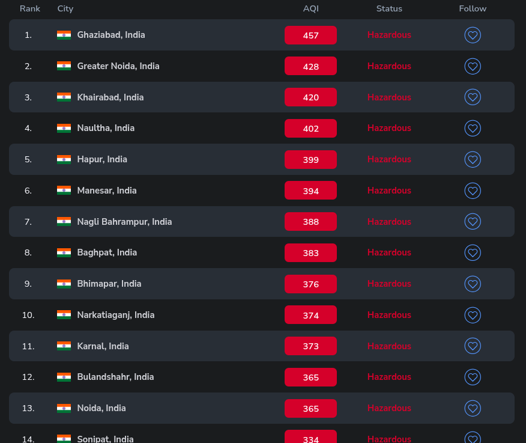

# Stubble Burning is a Distraction to pollution problem

Date: 10-11-2024

Update: 24-11-2025

Stubble burning is a distraction used to protect the corporate lobby, including factories that burn coal and the car industry. The lobby is so influential that no institute will dare to publish the actual data of Indian industries causing pollution.

Even if Indian data is obscured, global data clearly shows that the [coal and fossil fuel industries](https://iambrainstorming.github.io/chapters/invest_on_renewables.html), along with the [transportation especially car industry](https://iambrainstorming.github.io/chapters/road-planning-of-cities.html), are the largest polluters.

Also [creating green spaces and green cities](https://iambrainstorming.github.io/chapters/building-better-cities.html) is essential for tackling pollution and improving urban living conditions.

[The top 7 most polluting industries in 2024](https://www.theecoexperts.co.uk/blog/top-7-most-polluting-industries)

- The energy (fossil fuels) industry is the most polluting industry in the world
- The transport industry is the second most-polluting industry in the world

Politicians must stop misleading the public and address the real causes of pollution. [Incidents like Hasdeo](../justice/police-loyality.md), where police force was employed to facilitate coal industry expansion through deforestation, represent a profound betrayal of public trust. Such actions prioritize corporate interests over the health and well-being of citizens, effectively signing a death sentence for millions. India already leads the world in pollution-related deaths, a tragic statistic that underscores the urgent need for honest, sustainable policy decisions. Only by confronting the true sources of pollution can politicians protect public health and build a cleaner, safer future.

## CREA Report
Meanwhile, [a study by the Centre for Research on Energy and Clean Air (CREA)](https://navbharattimes.indiatimes.com/metro/delhi/other-news/delhi-ncr-pollution-main-causes-thermal-power-plants-polluting-more-than-stubble-burning/articleshow/115391931.cms) has been revealed. The study revealed that thermal power plants in NCR spread 16 times more air pollution than stubble burning. The highest pollution is caused by thermal power plants According to the study of CREA, "The thermal power plants in Delhi-NCR spread 16 times more pollution than the 17.8 kiloton pollution emitted from 89 lakh tonnes of stubble burning. The study said that between June 2022 and May 2023, coal-fired thermal power plants in NCR released 281 kiloton of sulphur dioxide (SO2).

[Thermal power plants in NCR emit 16 times more pollutants than stubble burning: Report ](https://www.businesstoday.in/india/story/thermal-power-plants-in-ncr-emit-16-times-more-pollutants-than-stubble-burning-report-454093-2024-11-18)

### India is the largest SO2 emitting country
India is currently the worlds largest SO2 emitter. It is responsible for more than 20% of global anthropogenic SO2 emissions. This is mainly due to its coal-dependent energy sector.

### Most SO2 coming out of thermal power plant
The study found that the comparison between NCR thermal power plant emissions and stubble burning emissions in Punjab and Haryana highlights the scale of SO2 pollution. Thermal power plants in NCR emit 281 kilotons of SO2 annually, which is 16 times more than the 17.8 kilotons emitted from 89 lakh tonnes of stubble burning.

## Database for all polluting units

Data on polluting factories in India is scarce and largely inaccessible to the public. Without transparent information, we cannot identify which units are causing harm, and therefore cannot take meaningful action. Only when polluting industries are clearly identified can pressure be applied—either to enforce compliance or to shut down the worst offenders.

**The government has failed to provide this crucial data, and powerful industrial lobbies actively resist transparency. This leaves the responsibility to civil society and independent institutions to map all factories, assess their pollution levels, and create an open, publicly accessible database.**

### What data to collect?

[Sketch for data collection](factories-datatabase.md)

## Should Coal Power Plants Install Anti-Pollution Systems?

[Environment Ministry exempts 78% of coal plants from installing key anti-polluting systems](https://www.thehindu.com/sci-tech/energy-and-environment/environment-ministry-exempts-78-of-coal-plants-from-installing-key-anti-polluting-systems/article69804518.ece)

The cost of Flue Gas Desulfurization (FGD) equipment for reducing sulfur dioxide emissions varies significantly based on technology and plant size. Estimates for wet limestone-gypsum FGD systems range from approximately ₹1 crore per megawatt (MW). More recent tenders from NTPC suggest a cost range of Rs 1.9 million to Rs 9 million per MW.

The cost of a 1 megawatt (MW) solar power plant in India typically ranges between ₹4 crore and ₹6 crore, depending on the type of installation, component quality, and whether battery backup is included. This cost breakdown includes solar PV modules (₹2.8 – ₹3.2 crore), inverters (₹80 lakh – ₹1 crore), mounting structures and cabling (₹40 – ₹60 lakh), installation and commissioning (₹20 – ₹30 lakh), and SCADA & monitoring systems (₹10 – ₹15 lakh). The price of components has steadily dropped throughout 2025, with solar panels alone accounting for about 50–55% of the total plant cost, amounting to roughly ₹2.5 crore.

**Solar installation costs are roughly twice that of Flue Gas Desulfurization (FGD) systems, yet solar requires no coal, no fuel cost, and minimal ongoing maintenance. In the long run, rooftop solar is far cheaper and more sustainable than investing in FGD for coal plants.**

## In 2025, India Dominates the List of 100 Most Polluted Cities — Over 90% Are Indian

[Aqi.in](https://www.aqi.in/in/real-time-most-polluted-city-ranking)

This is complete dystopia. Indians don’t even have the right to breathe. It affects politicians, bureaucrats, and their children alike — they too are breathing hazardous air. It should be a collective responsibility for everyone to take concrete steps to reduce pollution.

## Pollution Isn't Just a One-Day Issue: The Year-Round Impact of the Fossil Fuel Industry

During Diwali, families and children are often discouraged from celebrating due to heightened pollution levels, and [many Delhi residents even leave the city to escape the toxic air](https://scroll.in/article/1074991/why-some-delhi-residents-leave-the-city-during-diwali). With pollution present year-round, even a small increase becomes intolerable, impacting daily life and health. It’s crucial to recognize the primary causes of this pollution—namely, the fossil fuel and car industries—rather than focusing solely on a single-day celebration like Diwali. Affordable and efficient solar panels are now widely available and could replace fossil fuel industries, significantly reducing emissions. However, the government is not taking sufficient measures to promote rooftop, community-owned power generation through solar panels; instead, they remain focused on appeasing the fossil fuel industry. Additionally, we need to rethink urban design: rather than cities congested with cars that create traffic and occupy vast spaces, we should prioritize bike-friendly, pedestrian-oriented green cities. Shifting towards renewable energy and sustainable urban planning can make our cities healthier, cleaner, and safer for future generations.

> If you truly care about your children's future, it's time to stand against fossil fuels. Let’s ensure they inherit a world where they can breathe freely and live safely. Please don't complain about power outages or the inability to drive cars.

**Consider installing solar panels, requesting free of cost installation, using public transportation, and riding electric bikes to help reduce pollution.**
