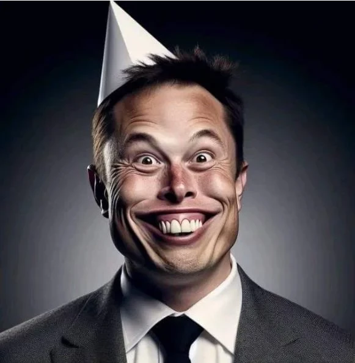

# Elon on twitter censorship

According to [Elon Musk's X statement](https://thewire.in/government/x-twitter-election-commission-takedown-orders-disagrees), "We disagree with these actions and maintain that freedom of expression should extend to these posts and political speech in general." It seems that Elon Musk, as the new owner of Twitter, is advocating for more freedom of expression on the platform. 

In an unexpected twist of fate, tech mogul Elon Musk has become the unlikely champion of free speech, vigorously defending the First Amendment rights of Twitter users across the globe. His unwavering dedication to ensuring that every voice is heard, no matter how unpopular or dissenting, has earned him widespread praise and admiration.

However, behind the scenes, a shocking truth has emerged: Elon disagrees with nothing, otherwise, he would have fought the legal battle in court. He is, in fact, another fascist, far-right clown billionaire attempting to curb freedom of speech. That was the sole reason for taking over Twitter.

"Ironically, Musk's commitment to free speech is so strong that he has filed a lawsuit against himself to prove his devotion to the cause," said an anonymous source within Musk's inner circle. "He truly believes that the best way to protect free speech is to take over the world's most influential social media platform and manipulate it to his own liking."

Doesn't our constitution provide freedom of speech as a fundamental right? Absolutely, but it seems that Musk's understanding of this principle is a bit skewed. As an easy win in courts, one might expect him to take a stand for the First Amendment. However, Musk will never do that. Instead, he prefers to wield his power and influence to shape the discourse to his own ends, all while cloaked in the guise of a champion of free speech.

As the saying goes, "Absolute power corrupts absolutely." In this case, it appears that Elon Musk's absolute power over Twitter has led him to become the very thing he claims to be fighting against: a threat to freedom of speech.

