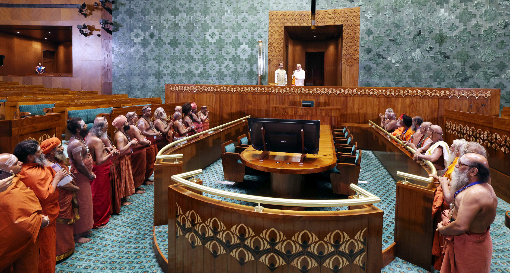

# From Godmen to Godfathers: How Babas Are Shaping Hindutva Politics and India’s Future

Gone are the days when self-proclaimed godmen and babas were exposed for their fraudulent practices and hauled away by the police. Today, they have transformed into influential figures, indoctrinating and mobilizing masses to build a formidable Hindutva vote bank. A [video from Bihar captures this unsettling reality](https://42683ff2b1a2ac5ad2fef0ee01995d78.ipfs.4everland.link/ipfs/bafybeicck4hvuphguu5fohqlkcg5zpcr2yddho4ztwcawm54nqezrddd6m): crowds of people gathered around a baba, swarming like insects drawn to ripe fruit. This imagery is not just a reflection of blind faith but also a testament to the growing politicization of religion in India.  

The rise of Hindutva politics has been accompanied by a systematic overhaul of India’s educational and cultural landscape. The periodic table and the theory of evolution, once cornerstones of scientific education, have been removed from school syllabi. These changes are not merely academic adjustments; they represent a deliberate attempt to reshape the collective mindset of a nation. For 70 years, the Congress-led secular education system, though flawed in its reliance on rote learning, at least aimed to foster a sense of inclusivity and diversity. However, the current government, in power for nearly a decade and a half, has taken a different path—one that prioritizes ideological indoctrination over critical thinking.  

The consequences of this shift are alarming. By undermining secular education, the government is not only eroding the foundations of rational thought but also jeopardizing the future of millions of young Indians. What do parents truly want for their children? Employment, opportunities, and a chance to thrive in a competitive world. Yet, the current trajectory seems to be steering youth toward a different fate—one where they are either pushed into religious roles, living off alms, or driven to despair by unemployment. India already has one of the highest student suicide rates in the world, a tragic reflection of the systemic failures and the immense pressure faced by the younger generation.  

[Over the past two decades, student suicides have grown at an alarming annual rate of 4%, double the national average. In 2022, male students constituted 53% of the total student suicides. Between 2021 and 2022, male student suicides decreased by 6% while female student suicides increased by 7%.](https://www.thehindu.com/sci-tech/health/indias-student-suicide-rate-surpassed-overall-trend-population-growth-rate-report/article68577171.ece)

To the 60% of Indians who have not voted for this government, this is an appeal to reflect on the direction in which the country is headed. Do we want a future where education is reduced to a tool for ideological propagation, where scientific temper is sacrificed at the altar of political expediency? Or do we envision a society that values secularism, critical thinking, and equal opportunities for all?  

The choice is ours to make. The stakes are high, and the time to act is now. Let us not allow the minds of our children to be played with or their futures to be compromised. Let us demand an education system that empowers, not enslaves; that enlightens, not obscures. The future of India depends on it.

